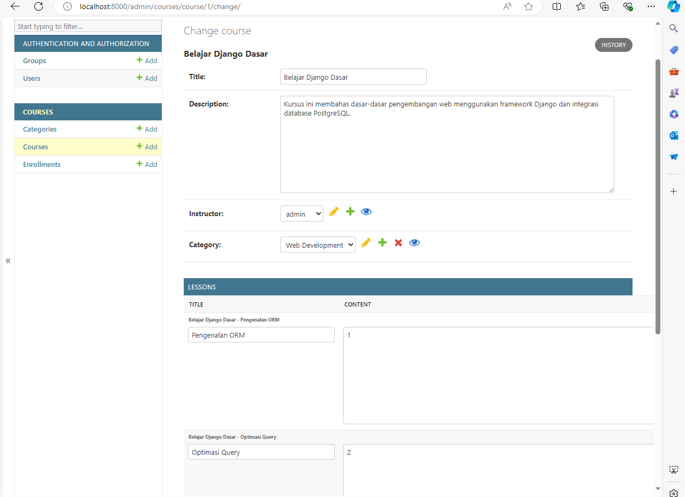
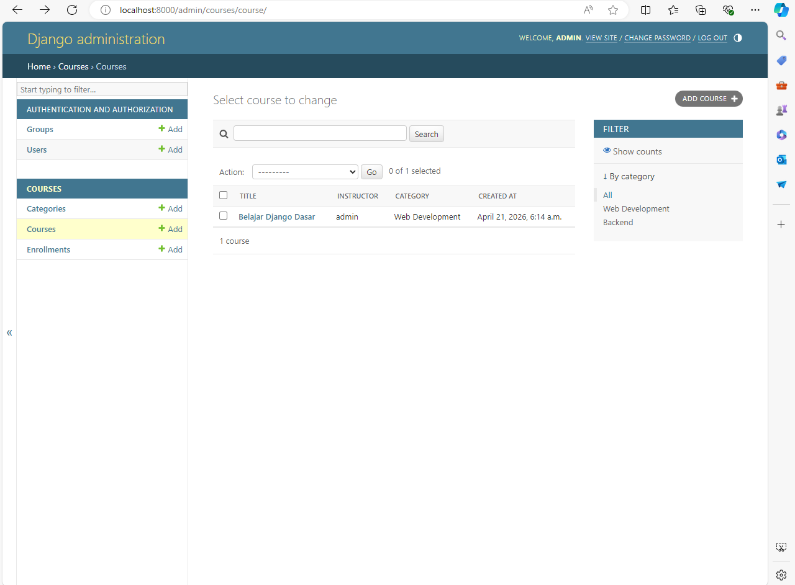

# Simple LMS - Django & Docker

Progress 1: Simple LMS - Docker & Django Foundation

## Cara Menjalankan Project

1. Build container: `docker-compose up --build -d`
2. Jalankan migrasi database: `docker-compose exec web python manage.py migrate`
3. Akses project di: `http://localhost:8000`

## Environment Variables Explanation

Konfigurasi database diatur melalui variabel lingkungan untuk memastikan keamanan kredensial. Berikut adalah variabel yang digunakan:

| Variabel  | Deskripsi                            |
| :-------- | :----------------------------------- |
| `DB_NAME` | Nama database PostgreSQL (lms_db)    |
| `DB_USER` | Username database (lms_user)         |
| `DB_PASS` | Password database (lms_password)     |
| `DB_HOST` | Nama service database di Docker (db) |
| `DB_PORT` | Port default PostgreSQL (5432)       |

## Screenshot Django welcome page


Progress 2: Simple LMS - Database Design & ORM Implementation

## Query Optimization Report

Optimasi dilakukan pada `Course.objects.for_listing()` menggunakan `select_related`.

**Hasil Perbandingan:**

- **Scenario N+1 (Tanpa Optimasi):** 3 Queries
- **Scenario Optimized (select_related):** 1 Query
- **Kesimpulan:** Berhasil mengurangi beban database sebesar 66% dengan menggabungkan pengambilan data Course, Instructor, dan Category dalam satu perintah JOIN.

## Django Admin Configuration

Fitur admin telah dikonfigurasi dengan:

- **Inline Lessons:** Memungkinkan manajemen materi langsung di dalam halaman Course.
- **Search & Filter:** Memudahkan pencarian berdasarkan judul dan kategori.

**1. List View dengan Kolom Informatif & Filter:**


**2. Detail View dengan Inline Lessons:**


## Cara Menjalankan Script Demo

Untuk memverifikasi optimasi query secara mandiri, jalankan:

```bash
docker-compose exec web python run_demo.py
```
