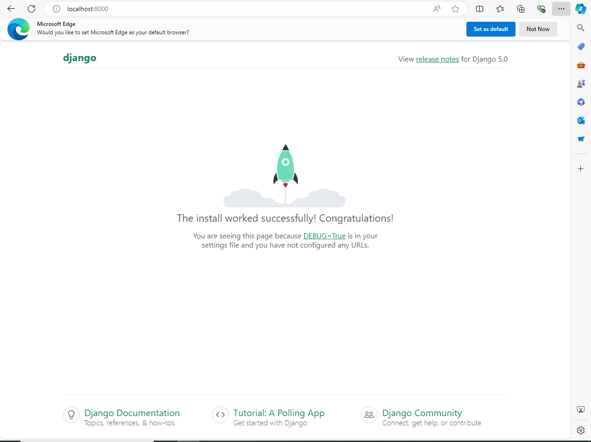

# Simple LMS - Django & Docker

Progress 1: Simple LMS - Docker & Django Foundation

## Cara Menjalankan Project

1. Build container: `docker-compose up --build -d`
2. Jalankan migrasi database: `docker-compose exec web python manage.py migrate`
3. Akses project di: `http://localhost:8000`

## ⚙️ Environment Variables Explanation

Konfigurasi database diatur melalui variabel lingkungan untuk memastikan keamanan kredensial. Berikut adalah variabel yang digunakan:

| Variabel  | Deskripsi                            |
| :-------- | :----------------------------------- |
| `DB_NAME` | Nama database PostgreSQL (lms_db)    |
| `DB_USER` | Username database (lms_user)         |
| `DB_PASS` | Password database (lms_password)     |
| `DB_HOST` | Nama service database di Docker (db) |
| `DB_PORT` | Port default PostgreSQL (5432)       |

## Screenshot Django welcome page

