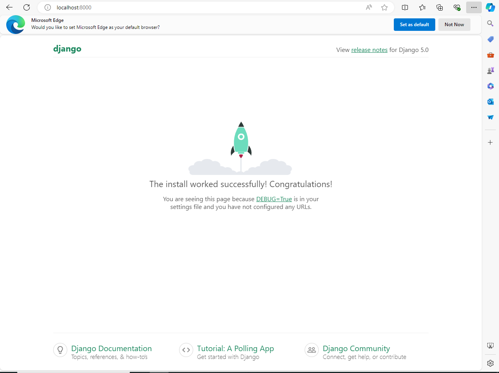
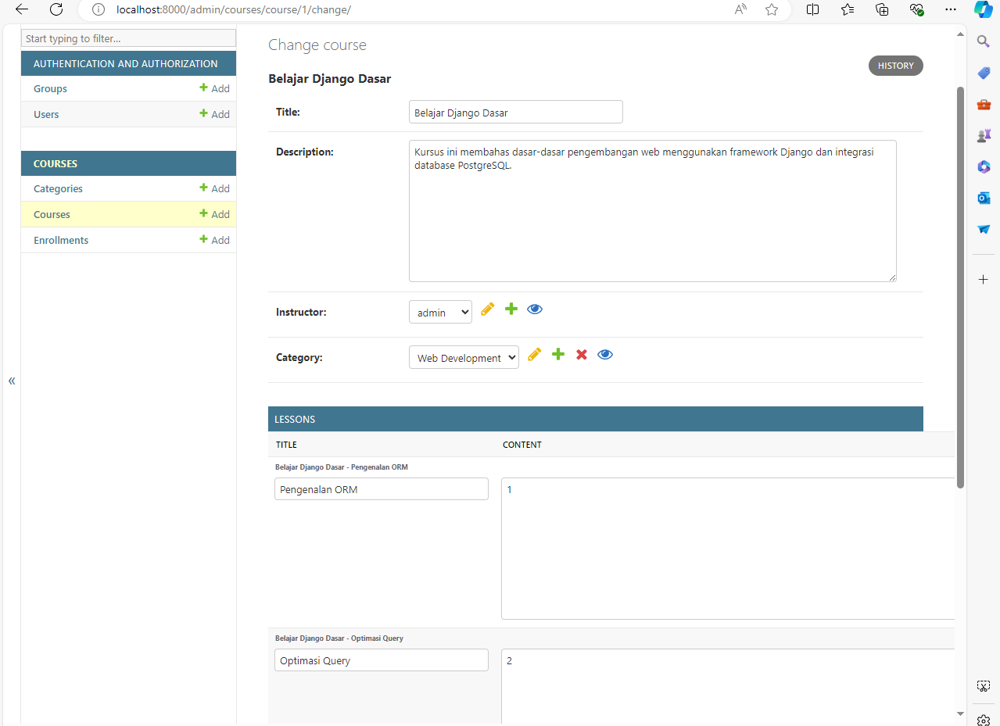
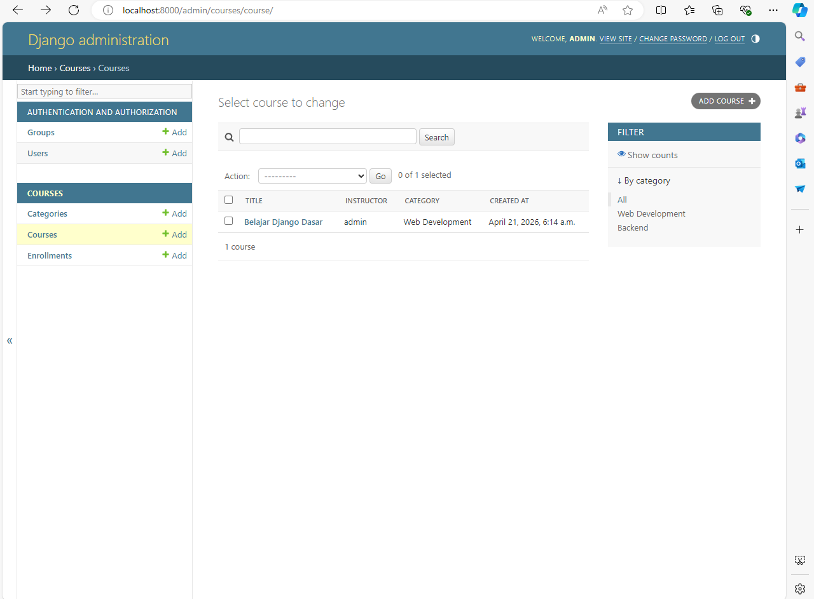
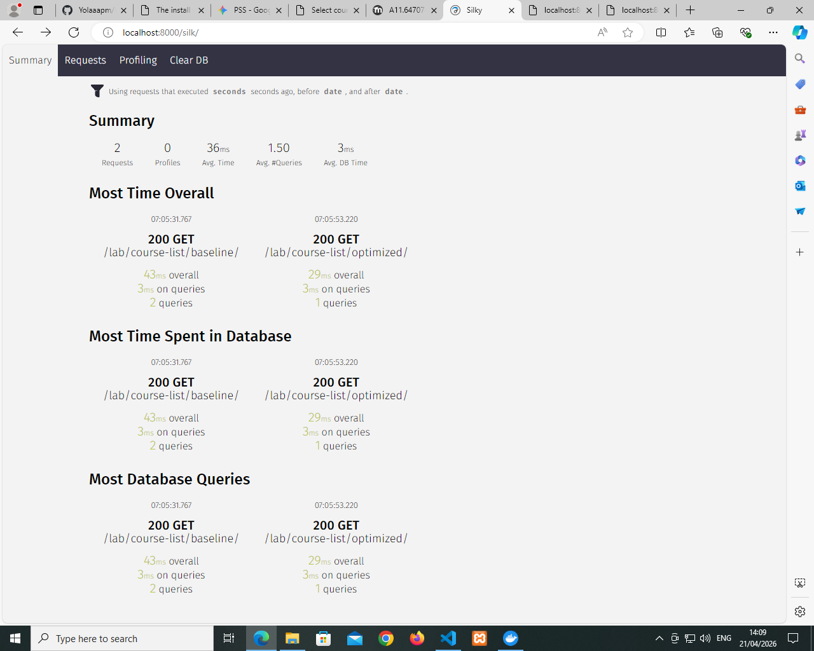
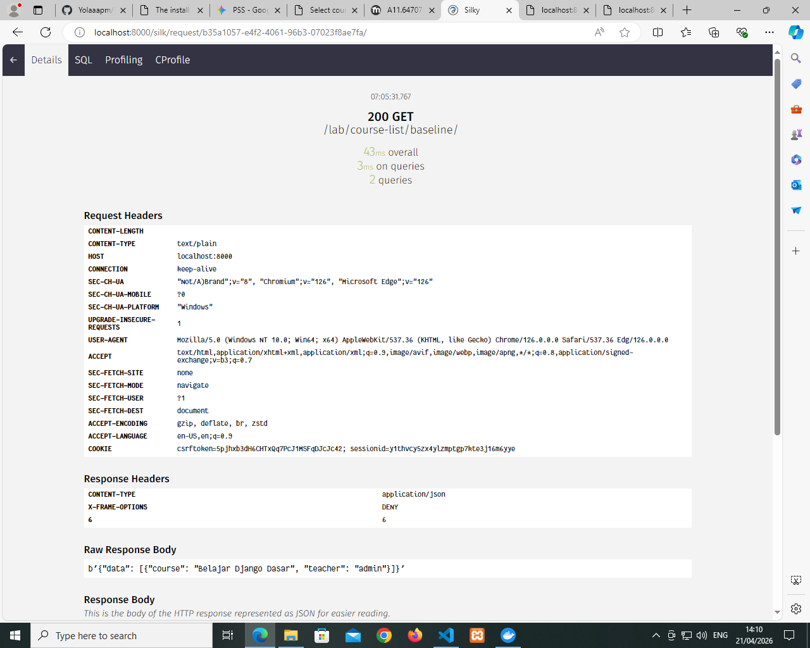
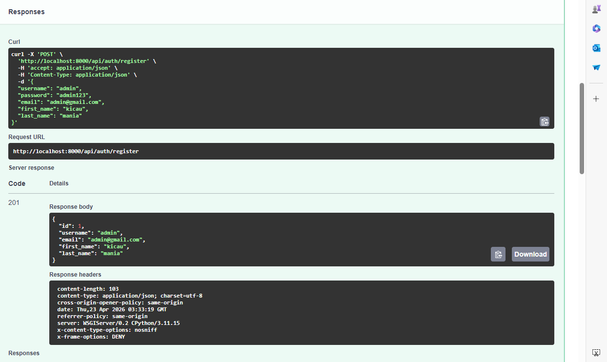
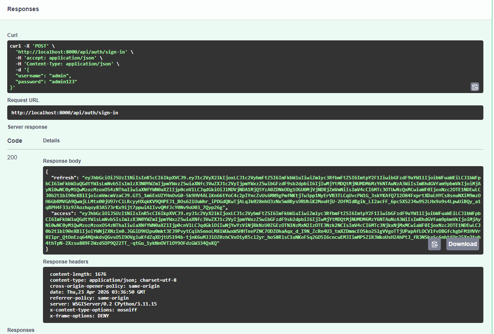
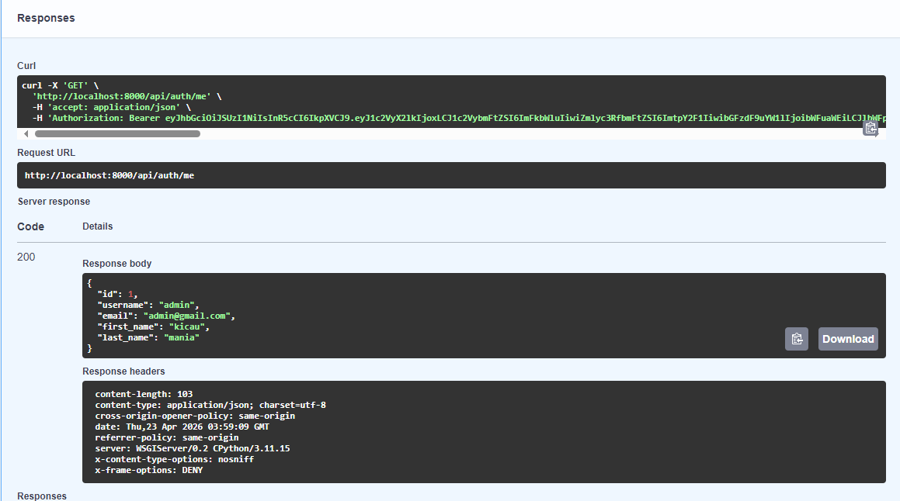

# Simple LMS - Django & Docker

Progress 1: Simple LMS - Docker & Django Foundation

## Cara Menjalankan Project

1. Build container: `docker-compose up --build -d`
2. Jalankan migrasi database: `docker-compose exec web python manage.py migrate`
3. Akses project di: `http://localhost:8000`

## Environment Variables Explanation

Konfigurasi database diatur melalui variabel lingkungan untuk memastikan keamanan kredensial. Berikut adalah variabel yang digunakan:

| Variabel  | Deskripsi                            |
| :-------- | :----------------------------------- |
| `DB_NAME` | Nama database PostgreSQL (lms_db)    |
| `DB_USER` | Username database (lms_user)         |
| `DB_PASS` | Password database (lms_password)     |
| `DB_HOST` | Nama service database di Docker (db) |
| `DB_PORT` | Port default PostgreSQL (5432)       |

## Screenshot Django welcome page



Progress 2: Simple LMS - Database Design & ORM Implementation

## Query Optimization Report

Optimasi dilakukan pada `Course.objects.for_listing()` menggunakan `select_related`.

**Hasil Perbandingan:**

- **Scenario N+1 (Tanpa Optimasi):** 3 Queries
- **Scenario Optimized (select_related):** 1 Query
- **Kesimpulan:** Berhasil mengurangi beban database sebesar 66% dengan menggabungkan pengambilan data Course, Instructor, dan Category dalam satu perintah JOIN.

## Django Admin Configuration

Fitur admin telah dikonfigurasi dengan:

- **Inline Lessons:** Memungkinkan manajemen materi langsung di dalam halaman Course.
- **Search & Filter:** Memudahkan pencarian berdasarkan judul dan kategori.

**1. List View dengan Kolom Informatif & Filter:**


**2. Detail View dengan Inline Lessons:**


## Cara Menjalankan Script Demo

Untuk memverifikasi optimasi query secara mandiri, jalankan:

```bash
docker-compose exec web python run_demo.py
```

Hasil Latihan Optimisasi DB

Query Optimization (Baseline)
Optimasi awal pada Course.objects.for_listing() menggunakan select_related.
Scenario N+1: 3 Queries
Scenario Optimized: 1 Query
Hasil: Efisiensi beban database meningkat 66%.

Database Indexing

Untuk memastikan performa tetap stabil pada data skala besar, kami menerapkan indexing pada courses/models.py:
Single Index: db_index=True pada kolom title (Course).
Composite Index: idx_course_inst_cat pada kolom instructor dan category.
Meta Index: idx_category_name pada tabel Category.

Perintah Berguna

Akses Dashboard Silk: http://localhost:8000/silk/
Membuat Superuser: docker-compose exec web python manage.py createsuperuser
Menjalankan Script Demo: docker-compose exec web python run_demo.py





Progress 3: Simple LMS - REST API & Authentication System




Progress 4: Advanced Features & Integration (Redis, MongoDB, & Celery)

Integrasi arsitektur enterprise untuk meningkatkan keandalan, skalabilitas, dan performa aplikasi di bawah beban kerja yang tinggi.

1. Redis Caching Patterns (Cache-Aside & Invalidation)

Course List Caching: Daftar kursus disimpan di memori Redis dengan TTL selama 300 detik untuk mengurangi beban PostgreSQL.

Course Detail Caching: Detail kursus disimpan di Redis selama 600 detik.

Cache Invalidation: Saat instruktur memicu operasi pembuatan (POST), pembaruan (PATCH), atau penghapusan (DELETE) kursus, sistem secara otomatis menghapus cache terkait (cache.delete("course_list_cache")) untuk menghindari penyajian data usang (stale data).

Rate Limiting: Membatasi pengguna maksimal 60 request/menit per alamat IP untuk mencegah serangan spamming kueri (DDoS ringan).

2. MongoDB Logging & Analytics

Menerapkan penyimpanan data berformat dokumen NoSQL untuk pencatatan riwayat tanpa membebani database transaksional relasional PostgreSQL:

Activity Log Collection: Menyimpan histori aktivitas penting (seperti pendaftaran, pencarian, ekspor data, dsb) lengkap dengan metadata pengguna dan timestamp.

Learning Analytics Collection: Merekam progres belajar siswa (penyelesaian materi, sertifikat).

Aggregation Queries: Menjalankan pipeline agregasi MongoDB (db.learning_analytics.aggregate) untuk menyajikan laporan analitik bagi staf/admin secara efisien.

3. Celery & RabbitMQ Asynchronous Tasks

Memindahkan tugas-tugas berat ke dalam antrean latar belakang (background queue) agar respon HTTP web tetap instan dan tidak memblokir (non-blocking):

send_enrollment_email: Mengirim email selamat datang secara otomatis di background ketika siswa mendaftar kursus.

generate_certificate: Menghasilkan ID sertifikat kelulusan unik saat progres materi diselesaikan siswa.

update_course_statistics: Scheduled task otomatis setiap jam menggunakan Celery Beat untuk memperbarui dan menyimpan snapshot statistik pendaftar kursus ke MongoDB.

export_course_report: Mengekspor daftar kursus lengkap ke dalam berkas CSV secara asinkron tanpa membebani server web utama.

🎛️ Dokumentasi Monitoring & Validasi

1. Flower Dashboard (Celery Task Monitoring)

Akses dasbor pemantauan grafis real-time tugas Celery di:

http://localhost:5555

Di sini, Anda dapat memantau status keberhasilan (Success), kegagalan (Failure), dan performa pengerjaan tugas dari worker.

2. Validasi Memori Redis Cache

Untuk membuktikan data caching masuk ke Redis, jalankan perintah berikut pada terminal:

# Masuk ke CLI Redis di dalam Container

docker exec -it simple-lms-redis redis-cli

# Melihat semua kata kunci (keys) cache yang aktif

127.0.0.1:6379> keys \*

# Menampilkan aktivitas operasi cache secara langsung (real-time)

127.0.0.1:6379> monitor

Simple LMS Project Portfolio - UDINUS Semarang.
